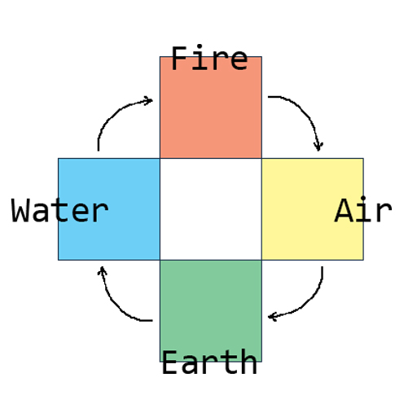

# Coder's Saga: The Four Elements
## Introduction
This world is made up of four elements: **Earth**, **Water**, **Fire** and **Air**. There are some of unordinary people who can feel those elemental energy, and **you** have that in your genetics.

Your country is currently at war and you are currently being ambushed by others with elemental potential. You will need to improvise and use elements to win the battles.

## Elemental Chart

```
Note: Start of arrow beats end of arrow.

Earth --> Water --> Fire --> Air
  ↑___________________________|
```

## Instructions
Go into the file named `elementalist.py` in this repository or click [here](/elementalist.py).

Then, copy the contents of the file to your computer and save the file as `.py` file.

After that, work on your code until you've completed the challenge. Follow the instructions given in [Objectives](#objectives). *Tip: (Always save and test challenge by running your file)*

Don't forget to submit your attempt to the link below! See [Submission](#submission).

## Objectives
You are given a starting `list` of elements,:
```python
elements = ["earth", "water", "fire", "air"]
```
a global integer variable:
```python
essence = 0
```
and multiple blank functions as your starter code.

### Write multiple functions to do the following:
* `weakness_of(element)` takes a String argument and returns the winning element as String. If the element argument is non-existant in elements list or invalid, return `"flee"`.

Example usage for `weakness_of`
```py
>>> weakness_of("fire")
water
>>> weakness_of("nature")
flee
```

* `collect_essence(amount)` takes an integer argument and perform addition to a global variable `essence`.

Expected output for `collect_essence`
```py
>>> essence = 0
>>> essence
0
>>> collect_essence(100)
>>> essence
100
```

* `battle(enemy)` takes a Dictionary argument with two different keys `(element: str, essence: int)` and does the following:
    * Firstly, consider what elements should be used on enemy or should you flee. *(Hint: You should use `weakness_of` function.)*
      * If you choose to flee, the battle ends. *(The function ends. What keyword is used to end a function abruptly?)*
    * If you have correctly chosen an element, you will defeat your enemy. Then, you'll need to collect their essence.
    * The battle will end after you've collected their essence.

Once you have completed all the functions or if you want to test them out just run the `elementalist.py` file. If you've done everything correctly and finally completed the challenge you will see a message,

```
VICTORIOUS!
You have defeated enemies and they are chased away from your home.
You have won this battle!
```
## Submission
You may submit your attempt of the challenge at: https://forms.gle/QmzUPHxjq3VKTr26A